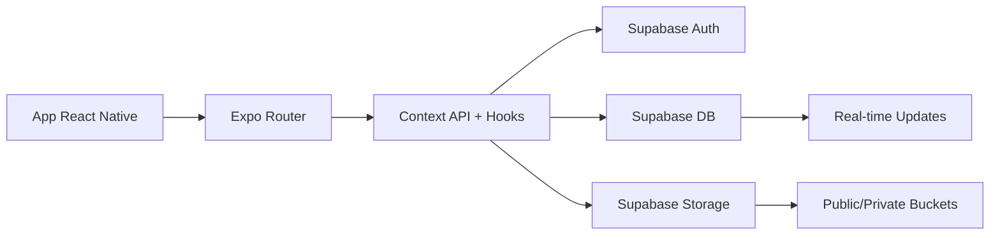

# AstraMentor Mobile 📱

<div align="center">
  

  [](https://reactnative.dev/)
  [](https://expo.dev/)
  [](https://www.typescriptlang.org/)
  [](https://supabase.io/)
</div>

## 📋 Visão Geral

O AstraMentor Mobile é uma plataforma educacional inovadora que conecta professores e alunos, facilitando o processo de ensino-aprendizado através de uma interface moderna e intuitiva. Desenvolvido como projeto de pós-graduação, o aplicativo demonstra as melhores práticas de desenvolvimento mobile com React Native e Expo.

## 🚀 Stack Tecnológica

| Categoria | Tecnologias |
|-----------|-------------|
| **Frontend** | React Native, Expo, TypeScript |
| **Backend** | Supabase (Auth, Database, Storage) |
| **Estilização** | Styled Components, React Native Paper |
| **Navegação** | React Navigation v6 |
| **Gerenciamento de Estado** | Context API, React Query |
| **Formulários** | React Hook Form, Yup |
| **Testes** | Jest, React Native Testing Library |
| **Linting/Formatting** | ESLint, Prettier |
| **CI/CD** | GitHub Actions |

## 📁 Estrutura do Projeto

```
src/
├── components/
│   ├── common/
│   └── layout/
├── screens/
│   ├── auth/
│   ├── home/
│   └── profile/
├── navigation/
├── services/
├── hooks/
├── contexts/
├── utils/
├── styles/
├── assets/
└── types/
```

## ✨ Funcionalidades Implementadas

- 🔐 **Autenticação**
- 🎯 **Navegação**
- 👤 **Perfil**
- 📚 **Conteúdo Educacional**


## 🔌 Integrações Supabase

### Autenticação
- JWT, sessões, políticas

### Banco de Dados
- Relacional, real-time


## 📦 Scripts Disponíveis

```bash
npm install
npm start
```

## 🛠️ Variáveis de Ambiente

```env
SUPABASE_URL=https://xxxxx.supabase.co
SUPABASE_ANON_KEY=your_anon_key_here
APP_ENV=development
```

## 🧩 Arquitetura Técnica



## 💡 Boas Práticas

- Clean Architecture
- Componentização
- TypeScript strict
- ESLint + Prettier
- Lazy loading
- Memoização

## 🚀 Instalação e Execução

```bash
git clone https://github.com/seu-usuario/astramentor-mobile.git
cd astramentor-mobile
npm install
cp .env.example .env
npm start
```

## 👥 Créditos

- **Desenvolvimento**: Davi, Marlon e Marcelo
- **Instituição**: FIAP

## 🎓 Considerações Acadêmicas

Projeto desenvolvido como parte da pós-graduação em Full Stack Development da FIAP. Envolve:
- Arquitetura de software
- Integração backend
- UX/UI
- Boas práticas

## 📝 Licença

MIT — veja [LICENSE](LICENSE).
